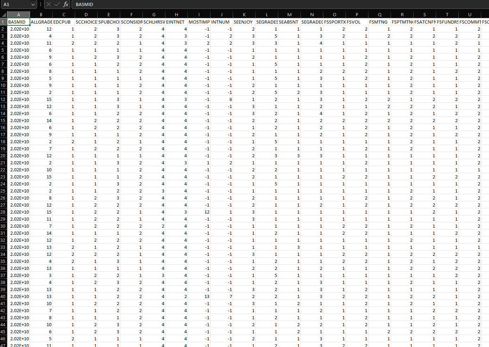
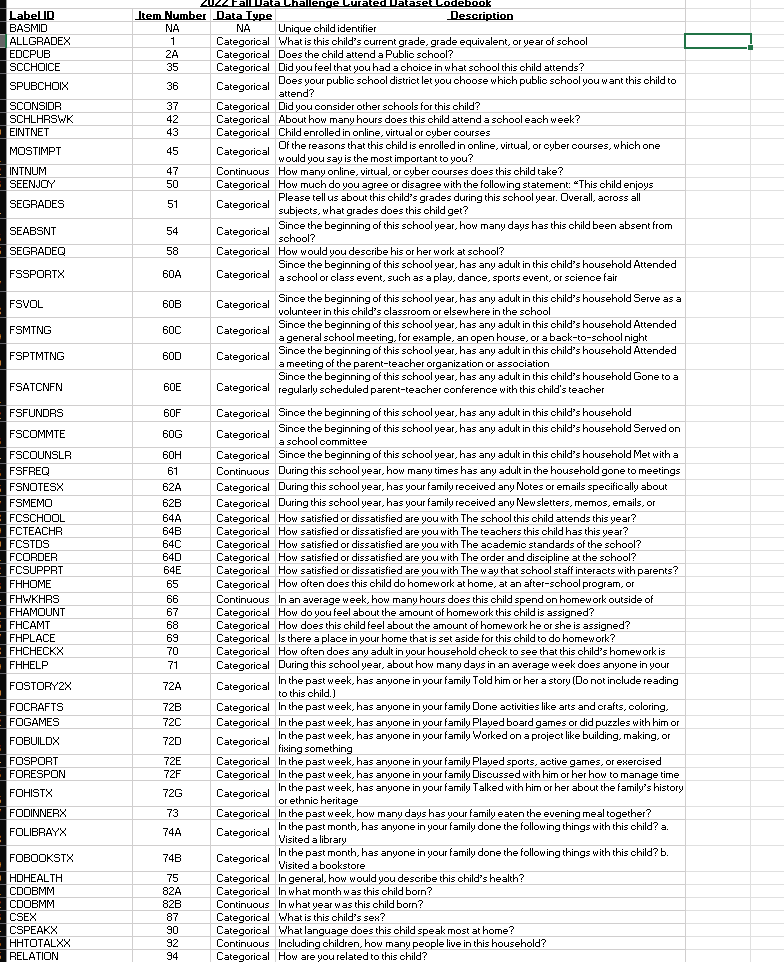

# Introduction to Mydata
```{r}
setwd("C:\\Users\\Joseph Waldron\\OneDrive - kean.edu\\symester3\\big data\\codeBigData\\week9\\my_project_Competition_f22")
```
Information collected from various sources. Include images if possible.

Image of raw data: 
```{r , echo=FALSE, fig.cap="raw", out.width = '75%',fig.align = 'center'}

```

Image of codebook

```{r , echo=FALSE, fig.cap="Codebook", out.width = '90%',fig.align = 'center'}

```

## Link to Data

Data webpage:  <https://nces.ed.gov/nhes/dataproducts.asp> 

## Questions/ Reasons 

Identify few questions about your data that you would like to address. 
Reasons that motivated you to select your data. 


# Packages

List and Load all packages that will be used in your project and include one line comment explaining the nature of the list.
For example: (dplyr: to wrangle and manipulate data)

```{r}
#library(dplyr) #this package is used for data manipulation
#library(maps) # this package to draw maps
#library(knitr)
```

# reading the data

include a chunk to read the data and names
```{r}
rd <- read.csv("2022 Fall Data Challenge Dataset.xlsx - curated 2019-required.csv")
```

# Data Wrangling

Clean and label and prepare your data
Show the size of the data
numbers of rows and columns
classes of columns, how many `NA`?
Print out few lines
Rename variables of interest if their original name is long
Any substetting?

```{r}
rd$BASMID <- factor(rd$BASMID)
rd$ALLGRADEX <- factor(rd$ALLGRADEX, levels = c(2:15), labels = c("Full-day kindergarden", "Partial-day kindergarden", "First grade", "Second grade", "Third grade", "Fourth grade", "Fifth grade", "Sixth grade", "Seventh grade", "Eighth grade", "Ninth grade", "Tenth grade", "Eleventh grade", "Twelfth grade"))
rd$EDCPUB <- factor(rd$EDCPUB, levels = c(1,2), labels = c("Yes", "No"))
rd$SCCHOICE <- factor(rd$SCCHOICE, levels = c(-1, 1,2), labels = c(NA, "Yes", "No"))
rd$SPUBCHOIX <- factor(rd$SPUBCHOIX, levels = c(-1, 1,2,3), labels = c(NA, "Yes", "No", "Don't Know"))
rd$SCONSIDR <- factor(rd$SCONSIDR, levels = c(-1, 1,2), labels = c(NA, "Yes", "No"))
rd$SCHLHRSWK <- factor(rd$SCHLHRSWK, levels = c(-1, 1,2,3,4), labels = c(NA,"0 hours. Child's school is not located in a physical building", "1-10 hours", "11-24 hours", "More than 24 hours"))
rd$EINTNET <- factor(rd$EINTNET, levels = c(-1, 1,2,3,4), labels = c(NA,"Yes, all the child’s courses are online,virtual, or cyber", "Yes, about half or more than half of the child’s courses are online, virtual,or cyber", "Yes, less than half of the child’s courses are online, virtual, or cyber", "No, none of this child’s courses are online, virtual, or cyber"))
rd$MOSTIMPT <- factor(rd$MOSTIMPT, levels = c(-1, 1,2,3,4,5,6,7,8,9,10,11,12,13,14), labels = c(NA,"Advanced courses", "Specialized courses","Make up a course","Additional credits","Extra help","Schedule conflict","Child has phicical or mental health problem that has lasted six months or more","Temporary illness","Other special needs","Learning style","Was required ","School placement","Prefer online, virtual or cyber courses","Other reason"))
rd$INTNUM <- factor(rd$INTNUM, levels = c(1:25))
rd$SEENJOY <- factor(rd$SEENJOY, levels = c(-1, 1,2,3,4), labels = c(NA,"Strongly agree", "Agree", "Disagree","Strongly disagree"))
rd$SEGRADES <- factor(rd$SEGRADES, levels = c(-1, 1,2,3,4,5), labels = c(NA,"Mostly A’s","Mostly B’s","Mostly C’s","Mostly D’s or lower","School does not give these grades"))
rd$SEABSNT <- factor(rd$SEABSNT, levels = c(-1, 1,2,3,4), labels = c(NA,"0 to 5 days", "6 to 10 days","11 to 20 days","More than 2 days"))
rd$SEGRADEQ <- factor(rd$SEGRADEQ, levels = c(-1, 1,2,3,4,5), labels = c(NA,"Excellent","Above average","Average","Below average","Failing"))
rd$FSSPORTX <- factor(rd$FSSPORTX, levels = c(-1, 1,2), labels = c(NA,"Yes", "No"))
rd$FSVOL <- factor(rd$FSVOL, levels = c(-1, 1,2), labels = c(NA,"Yes", "No"))
rd$FSMTNG <- factor(rd$FSMTNG, levels = c(-1, 1,2), labels = c(NA,"Yes", "No"))
rd$FSPTMTNG <- factor(rd$FSPTMTNG, levels = c(-1, 1,2), labels = c(NA,"Yes", "No"))
rd$FSATCNFN <- factor(rd$FSATCNFN, levels = c(-1, 1,2), labels = c(NA,"Yes", "No"))
rd$FSFUNDRS <- factor(rd$ FSFUNDRS, levels = c(-1, 1,2), labels = c(NA,"Yes", "No"))
rd$FSCOMMTE <- factor(rd$FSCOMMTE, levels = c(-1, 1,2), labels = c(NA,"Yes", "No"))
rd$FSCOUNSLR <- factor(rd$FSCOUNSLR, levels = c(-1, 1,2), labels = c(NA,"Yes", "No"))
rd$FSFREQ <- factor(rd$FSFREQ, levels = c(0:99))
rd$FSNOTESX <- factor(rd$FSNOTESX, levels = c(-1, 1,2), labels = c(NA,"Yes", "No"))
rd$FSMEMO <- factor(rd$FSMEMO, levels = c(-1, 1,2), labels = c(NA,"Yes", "No"))
rd$FCSCHOOL <- factor(rd$FCSCHOOL, levels = c(-1, 1,2,3,4), labels = c(NA,"Very satisfied", "Somewhat satisfied","Somewhat dissatisfied","Very dissatisfied"))
rd$FCTEACHR <- factor(rd$FCTEACHR, levels = c(-1, 1,2,3,4), labels = c(NA,"Very satisfied", "Somewhat satisfied","Somewhat dissatisfied","Very dissatisfied"))
rd$FCSTDS <- factor(rd$FCSTDS, levels = c(-1, 1,2,3,4), labels = c(NA,"Very satisfied", "Somewhat satisfied","Somewhat dissatisfied","Very dissatisfied"))
rd$FCORDER <- factor(rd$FCORDER, levels = c(-1, 1,2,3,4), labels = c(NA,"Very satisfied", "Somewhat satisfied","Somewhat dissatisfied","Very dissatisfied"))
rd$FCSUPPRT <- factor(rd$FCSUPPRT, levels = c(-1, 1,2,3,4), labels = c(NA,"Very satisfied", "Somewhat satisfied","Somewhat dissatisfied","Very dissatisfied"))
rd$FHHOME <- factor(rd$FHHOME, levels = c(-1, 1,2,3,4,5,6), labels = c(NA,"Less than once a week", "1 to 2 days a week","3 to 4 days a week","5 or more days a week","Never","Child does not have homework"))
rd$FHWKHRS <- factor(rd$FHWKHRS, levels = c(0:75))
rd$FHAMOUNT <- factor(rd$FHAMOUNT, levels = c(-1, 1,2,3), labels = c(NA,"The amount is about right", "It’s too much","It’s too little"))
rd$FHCAMT <- factor(rd$FHCAMT, levels = c(-1, 1,2,3), labels = c(NA,"The amount is about right", "It’s too much","It’s too little"))
rd$FHPLACE <- factor(rd$FHPLACE, levels = c(-1, 1,2,3), labels = c(NA,"Yes", "No", "Child does not do homework at home"))
rd$FHCHECKX <- factor(rd$FHCHECKX, levels = c(-1, 1,2,3,4), labels = c(NA,"Never", "Rarely", "Sometimes","Always"))
rd$FHHELP <- factor(rd$FHHELP, levels = c(-1, 1,2,3,4,5), labels = c(NA,"Less than once a week", "1 to 2 days a week", "3 to 4 days a week","5 or more days a week","Never"))
rd$FOSTORY2X <- factor(rd$FOSTORY2X, levels = c(1,2), labels = c("Yes", "No"))
rd$FOCRAFTS <- factor(rd$FOCRAFTS, levels = c(1,2), labels = c("Yes", "No"))
rd$FOGAMES <- factor(rd$FOGAMES, levels = c(1,2), labels = c("Yes", "No"))
rd$FOBUILDX <- factor(rd$FOBUILDX, levels = c(1,2), labels = c("Yes", "No"))
rd$FOSPORT <- factor(rd$FOSPORT, levels = c(1,2), labels = c("Yes", "No"))
rd$FORESPON <- factor(rd$FORESPON, levels = c(1,2), labels = c("Yes", "No"))
rd$FOHISTX <- factor(rd$FOHISTX, levels = c(1,2), labels = c("Yes", "No"))
rd$FODINNERX <- factor(rd$FODINNERX, levels = c(0:7), labels = c("None", "One day", "Two days", "Three days", "Four days", "Five days", "Six days", "Seven days"))
rd$FOLIBRAYX <- factor(rd$FOLIBRAYX, levels = c(1,2), labels = c("Yes", "No"))
rd$FOBOOKSTX <- factor(rd$FOBOOKSTX, levels = c(1,2), labels = c("Yes", "No"))
rd$FOBOOKSTX <- factor(rd$FOBOOKSTX, levels = c(1:5, labels = c("Excellent", "Very good", "Good", "Fair", "Poor"))
rd$CDOBMM <- factor(rd$CDOBMM, levels = c(1:12), labels = c("January", "February", "March", "April", "May", "June", "July", "August", "September", "October", "November", "December"))
rd$CDOBYY <- factor(rd$CDOBYY, levels = c(1998:2015))
rd$CSEX <- factor(rd$CSEX, levels = c(1,2), labels = c("Male", "Female"))
rd$CSPEAKX <- factor(rd$CSPEAKX, levels = c(1:6), labels = c("Child is not able to speak", "English", "Spanish", "English and Spanish equally", "A language other than English or Spanish", "English and another language equally"))
rd$HHTOTALXX <- factor(rd$HHTOTALXX, levels = c(2:10))
rd$RELATION <- factor(rd$RELATION, levels = c(1:11), labels = c("Mother (birth,adoptive, step, or foster)", "Father (birth, adoptive, step, or foster)", "Aunt", "Uncle", "Grandmother", "Grandfather", "Parent’s girl friend/boyfriend/partner", "Other relationship", "Sibling", "Two parents (birth, adoptive, step, foster) (new)", "Parent (birth, adoptive, step, foster), unspecified (new)"))
rd$P1REL <- factor(rd$P1REL, levels = c(1:6), labels = c("Biological parent", "Adoptive parent", "Stepparent", "Foster parent", "Grandparent", "Other guardian"))
rd$P1SEX <- factor(rd$P1SEX, levels = c(1,2), labels = c("Male", "Female"))
rd$P1MRSTA <- factor(rd$P1MRSTA, levels = c(1:5), labels = c("Now married", "Widowed", "Divorced", "Separated", "Never married"))
rd$P1EMPL <- factor(rd$P1EMPL, levels = c(1:7), labels = c("Employed for pay or income", "Self-employed", "Unemployed or out of work", "Full-time student", "Stay at home parent", "Retired","Disabled or unable to work"))
rd$P1HRSWK <- factor(rd$P1HRSWK, levels = c(1:80))
rd$P1MTHSWRK <- factor(rd$P1MTHSWRK, levels = c(0:12))
rd$P1AGE <- factor(rd$P1AGE, levels = c(15:90))
rd$P2GUARD <- factor(rd$P2GUARD, levels = c(1,2), labels = c("Yes", "No"))
rd$TTLHHINC <- factor(rd$TTLHHINC, levels = c(1:12), labels = c("$0 to $10,000", "$10,001 to $20,000", "$20,001 to $30,000", "$30,001 to $40,000", "$40,001 to $50,000", "$50,001 to $60,000", "$60,001 to $75,000 ", "$75,001 to $100,000", "$100,001 to $150,000", "$150,001 to $200,000", "$200,001 to $250,000", "$250,001 or more"))


```

Include str and summary if possible

# Tables Frequency and proportions

# Visualizations of contengency tables or numerical variables

include variuous plots
Annotate your plots:title, label axes, nice colors.

# Statistical techniques
Test your hypothesis

# Conclusions

Highlight the information obtained from your project about the data.
Include some questions that you wish to investigate further.


